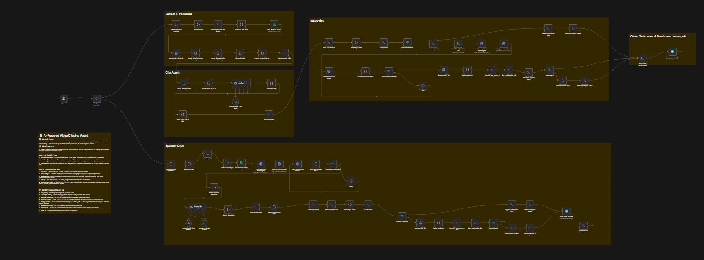
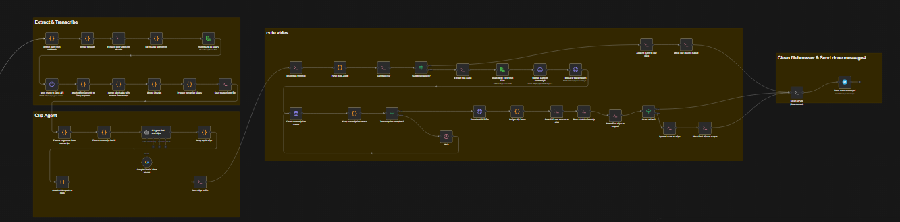
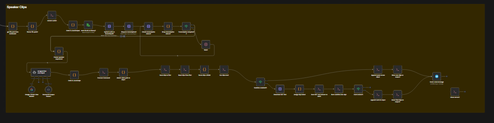
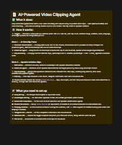

# Video Clipping Agent

An n8n automation that takes a long-form video, transcribes it, and produces subtitled clips — built to handle multi-hour videos without hitting API limits or losing timestamp accuracy.

## What it does

1. **Upload** — video comes in via webhook (from a custom upload dashboard)
2. **Chunk** — FFmpeg splits the audio into 10-minute segments to stay within transcription API limits
3. **Transcribe** — each chunk is sent to Groq's Whisper API in parallel, returning word- and segment-level timestamps
4. **Merge** — chunks are recombined with corrected timestamp offsets, deduplicated at segment boundaries
5. **Subtitle** — transcript is rendered as burned-in subtitles (including Arabic, right-to-left)
6. **Clip** — highlight segments are cut into individual clips
7. **Notify** — a Telegram message is sent when clips are ready, with a link to download

## Stack

- **n8n** — orchestration (self-hosted on a VPS)
- **FFmpeg** — audio extraction, chunking, subtitle burning
- **Groq (Whisper large-v3)** — speech-to-text transcription
- **AssemblyAI** — used for speaker diarization
- **Telegram API** — completion notifications
- **Nginx** — serves the upload dashboard and file downloads

## Workflow

Full canvas:

Broken into parts for readability:

## How to use

## Key challenges solved

- **Long video transcription**: Whisper APIs cap audio length, so video is chunked into 10-minute segments, transcribed in parallel, then merged back together with offset-corrected timestamps and boundary deduplication.
- **Arabic subtitle rendering**: FFmpeg's default subtitle renderer mishandles Arabic script shaping. Fixed by forcing `libass` with `shaping=complex`.
- **Timestamp drift across chunks**: each chunk's transcript timestamps are relative to that chunk, not the full video — offsets are calculated and applied during the merge step to keep subtitles in sync.

## Setup

This workflow expects the following credentials (not included in the export):

| Credential | Used for |
|---|---|
| Groq API key | Whisper transcription |
| AssemblyAI API key | Speaker diarization |
| Telegram bot token | Completion notifications |

Replace the placeholder values in `workflow.json` (`YOUR_GROQ_API_KEY`, `YOUR_ASSEMBLYAI_API_KEY`, `YOUR_SERVER_IP`) with your own before importing into n8n.

## Note

This is a portfolio export of a working production workflow. Some nodes reference infrastructure specific to my setup (VPS file server, Nginx-hosted dashboard) and would need adapting to run in a different environment.
