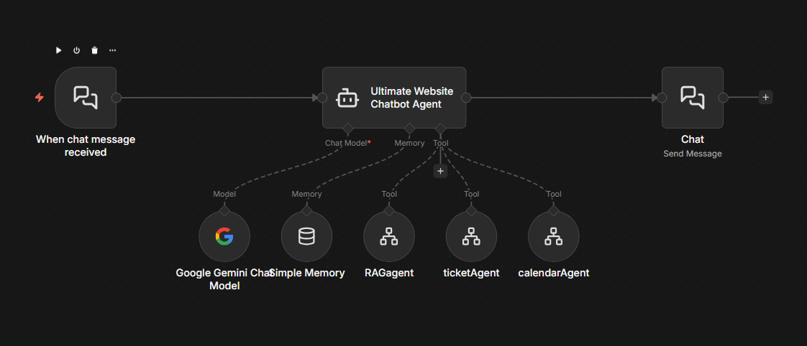
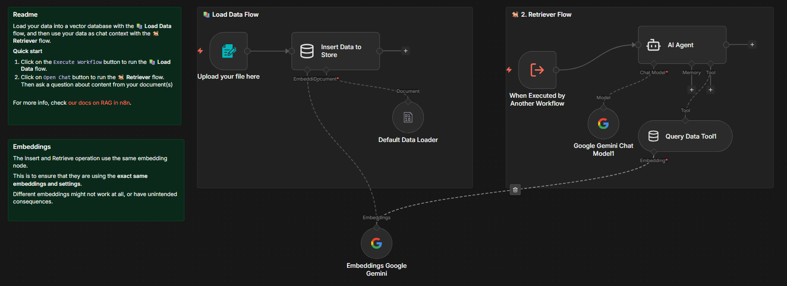
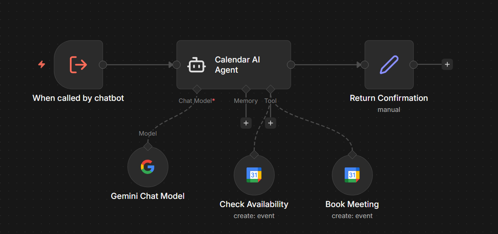
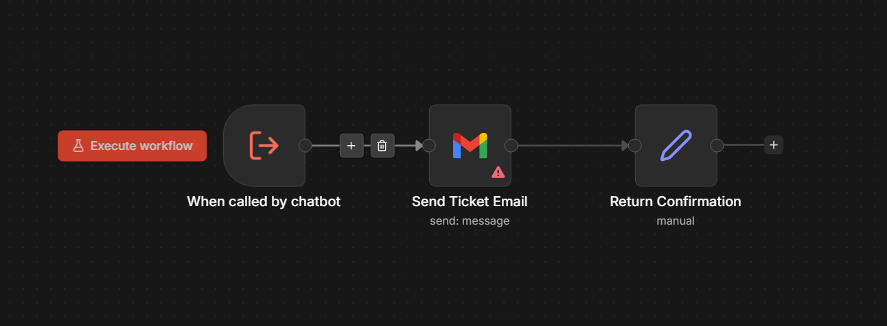
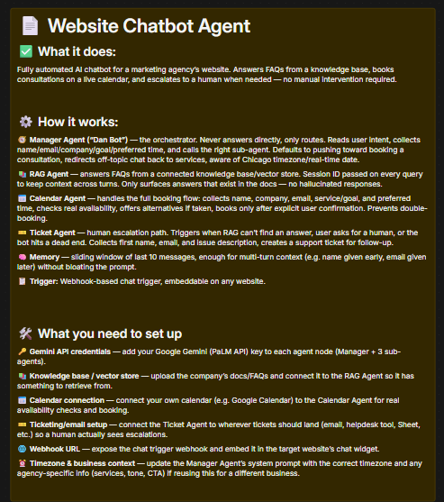

# Website Chatbot Agent

A fully autonomous, modular AI chatbot built for **Marketing Ladder**, a marketing agency — designed to handle real customer interactions directly on their website. It answers FAQs from a knowledge base, books consultations on a live calendar, and escalates complex requests to a human agent, all without manual intervention.

## Architecture

Built on a **manager + sub-agent** pattern: a central orchestrator reads user intent and delegates to specialized agents, rather than one agent trying to handle everything. Keeps the system modular, easier to debug, and cheaper to run token-wise.

## What it does

**Manager Agent — "Dan Bot"**
The router. Never answers questions directly — reads intent and calls the right sub-agent every time. Collects required info (name, email, company, goal, preferred time) before acting, defaults to pushing toward booking a consultation, redirects off-topic conversation back to the agency's services, and operates with real-time date/timezone awareness (Chicago).

**RAG Agent** — answers FAQs by querying a vector store / knowledge base. Session ID is passed with every query to maintain context across turns, and the bot only surfaces answers that actually exist in the company's documentation — no hallucinated responses.

**Calendar Agent** — handles the full booking flow: collects five data points (name, company, email, service/goal, preferred date & time), checks real availability, offers alternatives if a slot is taken, and only books after explicit user confirmation. Prevents double-booking by design.

**Ticket Agent** — the human escalation path. Triggers when the RAG agent can't find an answer, the user explicitly asks for a human, or the bot hits a dead end. Collects name, email, and issue description, then creates a support ticket for follow-up.

## How to use

## Stack

- **n8n** — orchestration
- **Google Gemini (PaLM API)** — LLM for manager + sub-agents
- **RAG / vector store** — knowledge base retrieval
- **Sliding window memory** — last 10 messages, kept for multi-turn context
- **Webhook chat trigger** — embeddable on any website

## Key design decisions

- **Multi-agent over one big agent** — each sub-agent stays small and focused, so the manager only needs to know *which tool to call*, not how to execute every task. Lowers token usage and improves routing accuracy.
- **Sliding window memory (10 messages)** — enough context to handle a user who gives their name in one message and their email three messages later, without bloating the prompt with irrelevant history.
- **Strict tool-only policy** — the manager is explicitly instructed to never answer on its own. Every response is grounded in either the knowledge base or a real calendar/ticketing action, removing hallucination risk at the orchestration layer.

## Setup

This workflow expects the following, none of which are included in the export:

| Requirement | Used for |
|---|---|
| Google Gemini API credential | Manager + sub-agent LLM calls |
| Vector store / knowledge base connection | RAG Agent FAQ retrieval |
| Calendar API credential | Availability checks + booking |
| Ticketing/email integration | Human escalation via Ticket Agent |
| Webhook trigger | Website chat embed |

## Note

This is a portfolio export of a working production chatbot, originally built for a marketing agency client. Some integrations (calendar provider, ticketing system, knowledge base) are specific to that client's setup and would need reconfiguring to run elsewhere.
